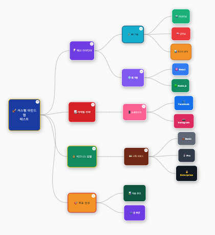
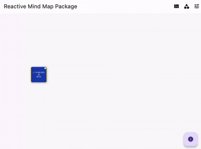

# Reactive Mind Map / 반응형 마인드맵

[](https://pub.dev/packages/reactive_mind_map)
[](https://opensource.org/licenses/MIT)

A highly customizable and interactive mind map package for Flutter with multiple layouts, dynamic sizing, and rich styling options.

Flutter용 다중 레이아웃, 동적 크기 조절, 다양한 스타일링 옵션을 제공하는 고도로 커스터마이징 가능한 인터랙티브 마인드맵 패키지입니다.

## Screenshots / 스크린샷

<p align="center">
  
</p>

*Multiple layouts and customization options / 다양한 레이아웃과 커스터마이징 옵션*

## Demo / 데모

<p align="center">
  
</p>

*Interactive expand/collapse and smooth animations / 인터랙티브 확장/축소 및 부드러운 애니메이션*

## Features / 기능

### Layouts / 레이아웃
- **Right Direction** / **오른쪽 방향**: Traditional right-expanding layout / 전통적인 오른쪽 확장 레이아웃
- **Left Direction** / **왼쪽 방향**: Left-expanding layout / 왼쪽 확장 레이아웃  
- **Top Direction** / **위쪽 방향**: Upward-expanding layout / 위쪽 확장 레이아웃
- **Bottom Direction** / **아래쪽 방향**: Downward-expanding layout / 아래쪽 확장 레이아웃
- **Radial** / **방사형**: Circular arrangement around root / 루트 주위 원형 배치
- **Horizontal Split** / **수평 분할**: Left-right split from root / 루트에서 좌우 분할
- **Vertical Split** / **수직 분할**: Top-bottom split from root / 루트에서 상하 분할

### Node Shapes / 노드 모양
- **Rounded Rectangle** / **둥근 직사각형**: Default rounded corners / 기본 둥근 모서리
- **Circle** / **원**: Perfect circle shape / 완전한 원 모양
- **Rectangle** / **직사각형**: Sharp rectangular corners / 날카로운 직사각형 모서리
- **Diamond** / **다이아몬드**: Diamond/rhombus shape / 다이아몬드/마름모 모양
- **Hexagon** / **육각형**: Six-sided polygon / 6각형 다각형
- **Ellipse** / **타원**: Oval/elliptical shape / 타원형 모양

### Customization / 커스터마이징
- **Dynamic Node Sizing** / **동적 노드 크기**: Automatic sizing based on text content / 텍스트 내용에 따른 자동 크기 조절
- **Custom Colors** / **커스텀 색상**: Node, text, and border colors / 노드, 텍스트, 테두리 색상
- **Rich Typography** / **풍부한 타이포그래피**: Font styles, sizes, and effects / 폰트 스타일, 크기, 효과
- **Animation Control** / **애니메이션 제어**: Customizable duration and curves / 커스터마이징 가능한 지속 시간과 곡선
- **Shadow Effects** / **그림자 효과**: Configurable node shadows / 설정 가능한 노드 그림자

### Interactions / 인터랙션
- **Tap Events** / **탭 이벤트**: Node selection and expansion / 노드 선택 및 확장
- **Long Press** / **길게 누르기**: Custom long press actions / 커스텀 길게 누르기 액션
- **Double Tap** / **더블 탭**: Double tap gestures / 더블 탭 제스처
- **Pan & Zoom** / **팬 및 줌**: Interactive navigation / 인터랙티브 내비게이션
- **Expand/Collapse** / **확장/축소**: Dynamic node visibility / 동적 노드 가시성

## Installation / 설치

Add this to your package's `pubspec.yaml` file:
`pubspec.yaml` 파일에 다음을 추가하세요:

```yaml
dependencies:
  reactive_mind_map: ^1.0.0
```

Then run / 그다음 실행하세요:

```bash
flutter pub get
```

## Usage / 사용법

### Basic Example / 기본 예제

```dart
import 'package:flutter/material.dart';
import 'package:reactive_mind_map/reactive_mind_map.dart';

class MyMindMap extends StatelessWidget {
  @override
  Widget build(BuildContext context) {
    final mindMapData = MindMapData(
      id: 'root',
      title: 'My Project',
      children: [
        MindMapData(id: '1', title: 'Planning'),
        MindMapData(id: '2', title: 'Development'),
        MindMapData(id: '3', title: 'Testing'),
      ],
    );

    return Scaffold(
      body: MindMapWidget(
        data: mindMapData,
        style: MindMapStyle(
          layout: MindMapLayout.right,
          nodeShape: NodeShape.roundedRectangle,
        ),
        onNodeTap: (node) => print('Tapped: ${node.title}'),
      ),
    );
  }
}
```

### Advanced Customization / 고급 커스터마이징

```dart
final customStyle = MindMapStyle(
  layout: MindMapLayout.radial,
  nodeShape: NodeShape.circle,
  enableAutoSizing: true,
  minNodeWidth: 80.0,
  maxNodeWidth: 200.0,
  connectionColor: Colors.blue,
  connectionWidth: 3.0,
  animationDuration: Duration(milliseconds: 600),
  enableNodeShadow: true,
  defaultNodeColors: [
    Colors.blue,
    Colors.green,
    Colors.orange,
    Colors.purple,
  ],
);

final mindMapWidget = MindMapWidget(
  data: myData,
  style: customStyle,
  onNodeTap: (node) {
    // Handle node tap / 노드 탭 처리
    print('Node tapped: ${node.title}');
  },
  onNodeLongPress: (node) {
    // Handle long press / 길게 누르기 처리
    _showNodeOptions(node);
  },
  onNodeExpandChanged: (node, isExpanded) {
    // Handle expand/collapse / 확장/축소 처리
    print('${node.title} ${isExpanded ? 'expanded' : 'collapsed'}');
  },
);
```

### Custom Node Data / 커스텀 노드 데이터

```dart
final customNode = MindMapData(
  id: 'custom-1',
  title: 'Custom Node',
  color: Colors.deepPurple,
  textColor: Colors.white,
  borderColor: Colors.yellow,
  size: Size(120, 80),
  textStyle: TextStyle(
    fontWeight: FontWeight.bold,
    fontSize: 14,
    decoration: TextDecoration.underline,
  ),
  customData: {
    'priority': 'high',
    'deadline': '2024-12-31',
    'assignee': 'John Doe',
  },
);
```

## API Reference / API 참조

### MindMapData

| Property / 속성 | Type / 타입 | Description / 설명 |
|-----------------|-------------|-------------------|
| `id` | `String` | Unique identifier / 고유 식별자 |
| `title` | `String` | Node display text / 노드 표시 텍스트 |
| `children` | `List<MindMapData>` | Child nodes / 자식 노드들 |
| `color` | `Color?` | Node background color / 노드 배경색 |
| `textColor` | `Color?` | Text color / 텍스트 색상 |
| `borderColor` | `Color?` | Border color / 테두리 색상 |
| `size` | `Size?` | Custom node size / 커스텀 노드 크기 |
| `textStyle` | `TextStyle?` | Text styling / 텍스트 스타일링 |
| `customData` | `Map<String, dynamic>?` | Additional data / 추가 데이터 |

### MindMapStyle

| Property / 속성 | Type / 타입 | Default / 기본값 | Description / 설명 |
|-----------------|-------------|------------------|-------------------|
| `layout` | `MindMapLayout` | `right` | Layout direction / 레이아웃 방향 |
| `nodeShape` | `NodeShape` | `roundedRectangle` | Node shape / 노드 모양 |
| `enableAutoSizing` | `bool` | `true` | Dynamic sizing / 동적 크기 조절 |
| `minNodeWidth` | `double` | `60.0` | Minimum node width / 최소 노드 너비 |
| `maxNodeWidth` | `double` | `200.0` | Maximum node width / 최대 노드 너비 |
| `connectionColor` | `Color` | `Colors.grey` | Connection line color / 연결선 색상 |
| `connectionWidth` | `double` | `2.5` | Connection line width / 연결선 두께 |
| `animationDuration` | `Duration` | `500ms` | Animation duration / 애니메이션 지속 시간 |
| `enableNodeShadow` | `bool` | `true` | Node shadow effect / 노드 그림자 효과 |

### Callbacks / 콜백

| Callback / 콜백 | Parameters / 매개변수 | Description / 설명 |
|-----------------|----------------------|-------------------|
| `onNodeTap` | `MindMapData node` | Node tap event / 노드 탭 이벤트 |
| `onNodeLongPress` | `MindMapData node` | Long press event / 길게 누르기 이벤트 |
| `onNodeDoubleTap` | `MindMapData node` | Double tap event / 더블 탭 이벤트 |
| `onNodeExpandChanged` | `MindMapData node, bool isExpanded` | Expand/collapse event / 확장/축소 이벤트 |

## Performance / 성능

- **Optimized Rendering** / **최적화된 렌더링**: Efficient drawing with custom painters / 커스텀 페인터를 사용한 효율적인 그리기
- **Dynamic Calculations** / **동적 계산**: Smart spacing based on content / 콘텐츠 기반 스마트 간격
- **Memory Efficient** / **메모리 효율적**: Minimal widget tree overhead / 최소한의 위젯 트리 오버헤드
- **Smooth Animations** / **부드러운 애니메이션**: Hardware-accelerated transitions / 하드웨어 가속 트랜지션

## License / 라이선스

This project is licensed under the MIT License - see the [LICENSE](LICENSE) file for details.

이 프로젝트는 MIT 라이선스 하에 있습니다 - 자세한 내용은 [LICENSE](LICENSE) 파일을 참조하세요.

## Contributing / 기여

Contributions are welcome! Please feel free to submit a Pull Request.

기여를 환영합니다! 언제든지 Pull Request를 제출해 주세요.

## Issues / 이슈

If you encounter any issues or have feature requests, please file them in the [GitHub Issues](https://github.com/devpark435/reactive_mind_map/issues) section.

이슈가 발생하거나 기능 요청이 있으시면 [GitHub Issues](https://github.com/devpark435/reactive_mind_map/issues) 섹션에 등록해 주세요.

## 변경 이력

최신 변경사항은 [CHANGELOG.md](CHANGELOG.md)를 확인하세요.